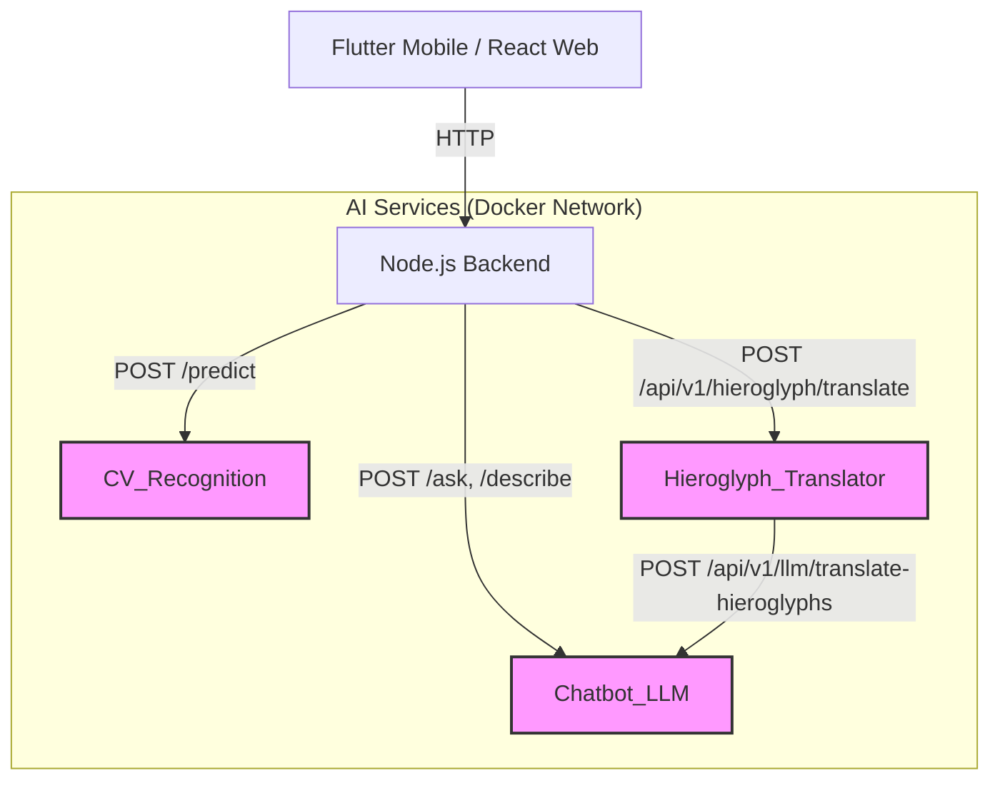

<<<<<<< HEAD
# KHEMET AI Services

This directory (`AI_services/`) contains the internal Python-based machine learning microservices for the KHEMET Egyptian artifact tourism platform.

All services are built with **FastAPI** and run completely locally using Docker. **No external APIs are used.** They communicate with each other and with the Node.js backend over the internal Docker network. Mobile and Web clients *never* connect to these AI services directly.

## Service Overview

### 1. `CV_Recognition/` (Computer Vision Recognition)
*   **Purpose:** Classifies uploaded images of ancient Egyptian artifacts.
*   **Model:** Uses a locally hosted `tensorflow-cpu` image classification model (e.g., `model.h5`).
*   **Primary Endpoint:** `POST /predict` (accepts an image file, returns a predicted class name and confidence score).
*   **Usage:** Used by the mobile app's scanner feature to identify statues, masks, and monuments.

### 2. `chatbot_LLM/` (Retrieval-Augmented Generation & LLM)
*   **Purpose:** Provides expert historical knowledge and translation capabilities.
*   **Architecture:**
    *   **Vector DB:** ChromaDB holding chunks of Egyptian historical data.
    *   **Embeddings:** `SentenceTransformers` (e.g., Qwen3).
    *   **LLM:** Locally accessible Large Language Model (configured via Groq/local API).
*   **Key Endpoints:**
    *   `POST /ask`: Answers free-form questions about ancient Egypt using RAG.
    *   `POST /describe`: Generates visitor-friendly descriptions for specific monuments.
    *   `POST /identify`: Answers questions about a specific artifact identified by the `CV_Recognition` service.
    *   `POST /api/v1/llm/translate-hieroglyphs`: Translates a sequence of Gardiner codes into English (used internally by `hieroglyph_translator`).

### 3. `hieroglyph_translator/` (Hieroglyph Detection and Translation)
*   **Purpose:** Detects Egyptian hieroglyphs in images and translates them into English.
*   **Architecture:** A two-stage pipeline.
    *   **Stage 1 (Detection):** Uses a local YOLOv11 model (`best_V2.pt`) to detect bounding boxes and classify 805 distinct Gardiner codes. Sorts symbols into reading order (left-to-right, top-to-bottom).
    *   **Stage 2 (Translation):** Forwards the ordered Gardiner codes to the `chatbot_LLM` service for English translation.
*   **Key Endpoints:**
    *   `POST /api/v1/hieroglyph/translate`: Runs the full detection + translation pipeline.
    *   `POST /api/v1/hieroglyph/detect-only`: Runs only YOLO detection.

## Internal Architecture & Communication flow



## Running the Services

All services are orchestrated via the root `docker-compose.yml`.

To build and run all AI services:

```bash
cd .. # Go to project root
docker-compose up --build cv-recognition chatbot-llm hieroglyph-translator
```

**Important Note on Models:**
Large model weights (like `.h5`, `.pt` files, and HuggingFace cache directories) are typically mounted as Docker volumes rather than baked into the Docker images. Ensure the weights are placed in the correct directories (e.g., `CV_Recognition/model/`, `hieroglyph_translator/model/`) before starting the containers.
=======
# ai_services
All AI services in one place 
>>>>>>> c127e323756cf9b26a91a073d5cbd08c70c36089
