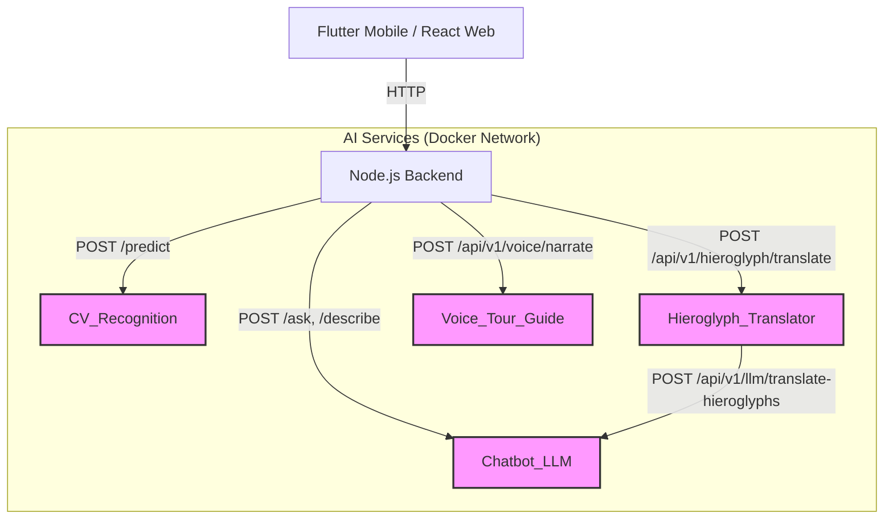

# KHEMET AI Services

This directory (`AI_services/`) contains the internal Python-based machine learning microservices for the KHEMET Egyptian artifact tourism platform.

All services are built with **FastAPI** and run completely locally using Docker. **No external APIs are used.** They communicate with each other and with the Node.js backend over the internal Docker network. Mobile and Web clients *never* connect to these AI services directly.

## Service Overview

### 1. `CV_Recognition/` (Computer Vision Recognition)
*   **Purpose:** Classifies uploaded images of ancient Egyptian artifacts.
*   **Model:** Uses a locally hosted `tensorflow-cpu` image classification model (e.g., `model.h5`).
*   **Primary Endpoint:** `POST /predict` (accepts an image file, returns a predicted class name and confidence score).
*   **Usage:** Used by the mobile app's scanner feature to identify statues, masks, and monuments.

### 2. `chatbot_LLM/` (Retrieval-Augmented Generation & LLM)
*   **Purpose:** Provides expert historical knowledge and translation capabilities.
*   **Architecture:**
    *   **Vector DB:** ChromaDB holding chunks of Egyptian historical data.
    *   **Embeddings:** `SentenceTransformers` (e.g., Qwen3).
    *   **LLM:** Locally accessible Large Language Model (configured via Groq/local API).
*   **Key Endpoints:**
    *   `POST /ask`: Answers free-form questions about ancient Egypt using RAG.
    *   `POST /describe`: Generates visitor-friendly descriptions for specific monuments.
    *   `POST /identify`: Answers questions about a specific artifact identified by the `CV_Recognition` service.
    *   `POST /api/v1/llm/translate-hieroglyphs`: Translates a sequence of Gardiner codes into English (used internally by `hieroglyph_translator`).

### 3. `hieroglyph_translator/` (Hieroglyph Detection and Translation)
*   **Purpose:** Detects Egyptian hieroglyphs in images and translates them into English.
*   **Architecture:** A three-stage pipeline.
    *   **Stage 1 (Detection & Sorting):** Uses a local YOLOv11 model (`best_V2.pt`) to detect bounding boxes for Gardiner codes. It automatically deduplicates overlapping predictions (keeping the highest confidence) and spatially sorts symbols dynamically (LTR or RTL).
    *   **Stage 2 (Knowledge Base):** Cross-references codes against `gardiner_master.json` in the `chatbot_LLM` to extract raw English meanings and phonetics.
    *   **Stage 3 (LLM Refinement):** The `chatbot_LLM` service analyzes the sequence using Llama 3 to identify Royal Titles, Deity Names, or Common Phrases, outputting structured JSON with transliterations and cultural context.
*   **Key Endpoints:**
    *   `POST /api/v1/hieroglyph/translate`: Runs the full detection + translation pipeline.
    *   `POST /api/v1/hieroglyph/detect-only`: Runs only YOLO detection.

### 4. `voice_tour_guide/` (AI Audio Narration)
*   **Purpose:** Converts artifact narratives into MP3 audio using Text-to-Speech (TTS).
*   **Architecture:**
    *   **Synthesis:** Uses ElevenLabs API (`eleven_multilingual_v2`) for lifelike multilingual TTS (English & Arabic).
    *   **Design:** A lightweight, single-responsibility microservice. All story generation (LLM) is done by `chatbot_LLM`, and all caching/database work is handled by the Node.js backend. No local fallback model is used.
*   **Key Endpoints:**
    *   `POST /generate`: Converts text to an MP3 audio file and returns the static file URL.

## Internal Architecture & Communication flow



## Running the Services

All services are orchestrated via the root `docker-compose.yml`.

To build and run all AI services:

```bash
cd .. # Go to project root
docker-compose up --build cv-recognition chatbot-llm hieroglyph-translator voice-tour-guide
```

**Important Note on Models:**
Large model weights (like `.h5`, `.pt` files, and HuggingFace cache directories) are typically mounted as Docker volumes rather than baked into the Docker images. Ensure the weights are placed in the correct directories (e.g., `CV_Recognition/model/`, `hieroglyph_translator/model/`) before starting the containers.

## Production Hardening & Middleware

All AI microservices have been hardened for production to ensure stability, observability, and security. Standardized architectural improvements across all services include:

*   **Structured JSON Logging:** Using advanced logging mechanisms for consistent, machine-readable log outputs across all services.
*   **Request Tracing (UUID):** Every incoming request is assigned a unique UUID via the `request_id.py` middleware, allowing seamless end-to-end tracing across the microservice ecosystem.
*   **CORS Management:** Handled dynamically via environment variables to restrict and secure access exclusively to the backend gateway.
*   **Graceful Shutdown Routines:** Intercepts termination signals (SIGINT/SIGTERM) to safely close database connections, release models, and flush logs before exiting.
*   **Environment Validation:** Strict startup checks ensure that critical environment variables (e.g., API keys, model paths) are present before the application initializes.
